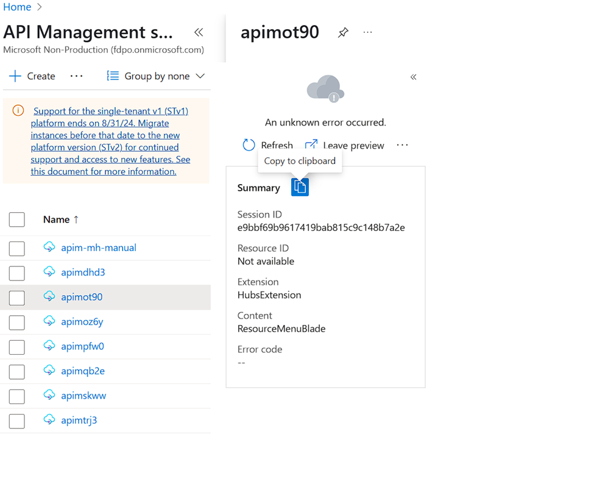
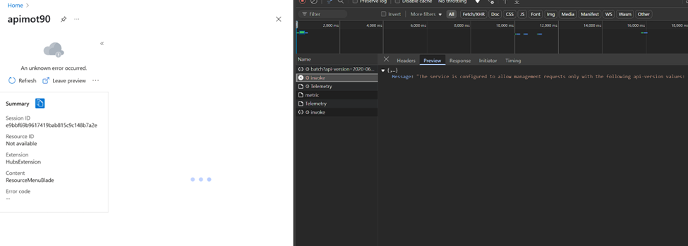
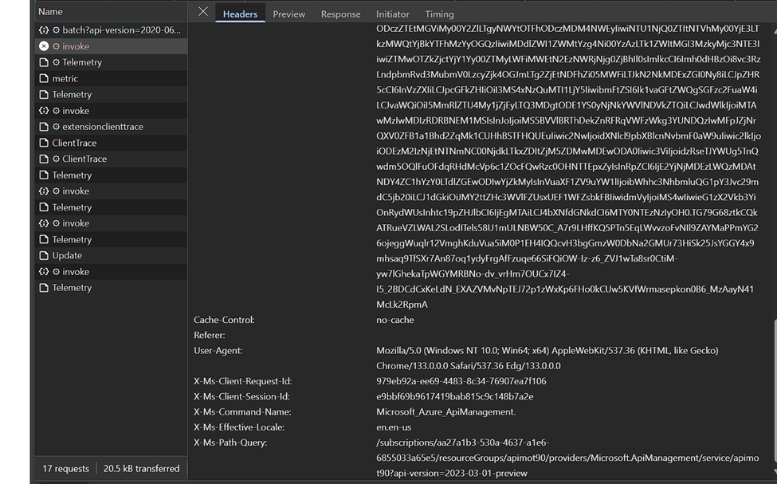

# Azure API Management (APIM) Terraform and Azure Portal Issue

## Summary

There is an issue with the Azure API Management (APIM) Terraform provider when setting the `min_api_version` to a value greater than `2022-08-01`. This issue is related to the version of the APIM SDK used by Terraform and the Azure Portal's API version.

---

When setting the `min_api_version` of Azure API Management (APIM) in Terraform to a value greater than `2022-08-01`, Terraform fails with the following error:  

```
Error: listing APIs after creation of Service (Subscription: "aa27a1b3-530a-4637-a1e6-6855033a65e5"
│ Resource Group Name: "apimdhd3"
│ Service Name: "apimdhd3"): unexpected status 400 (400 Bad Request) with error: 
MissingOrIncorrectVersionParameter: API version query parameter is not specified or was specified incorrectly.
```

### Root Cause  
The issue occurs because Terraform itself is using version `2022-08-01` of the APIM SDK. Setting `min_api_version` to any version beyond that causes APIM to fail.  

### Example Terraform Code  
An example of the Terraform code used to deploy this can be found here:  
[GitHub - avm-res-apimanagement-service (main.tf, Line 40)](https://github.com/mhassaninmsft/avm-res-apimanagement-service/blob/mhassnain/initial/main.tf#L40)  

### Temporary Workaround  
To bypass this issue, I manually updated the APIM version to `2024-05-01` in the `terraform-provider-azurerm` repository, recompiled the provider, and used it locally. This successfully resolved the issue, and Terraform no longer displayed any errors.  

I have also opened a PR into the HashiCorp repository:  
[GitHub - HashiCorp Terraform Provider AzureRM PR #28965](https://github.com/hashicorp/terraform-provider-azurerm/pull/28965)  

### Remaining Issue  
Despite this fix, the problem persists because the **Azure Portal itself** uses the REST API with an API version of `2022-08-01` when interacting with APIM. See screenshot below:



This means that even if the Terraform provider is updated, the Azure Portal will still encounter issues when trying to interact with APIM using a version greater than `2022-08-01`.

#### Error Message from Azure Portal:  
```
The service is configured to allow management requests only with the following api-version values: 
2023-05-01-preview, 2023-09-01-preview, 2024-05-01, 2024-06-01-preview, 2024-10-01-preview.
```
The above message is obtained by opening developer tools in the browser and checking the network tab when trying to access APIM in the Azure Portal.


Furthermore, the Azure Portal currently uses `api-version: 2023-03-01-preview`, as shown at the bottom of the screenshot below

